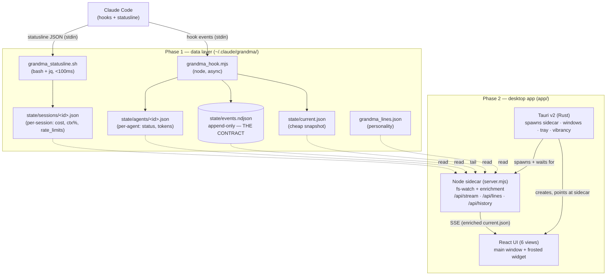

# Architecture

Grumpy Grandma is two phases joined by a single contract — an append-only event log. Phase 1
produces it from Claude Code; Phase 2 consumes it. Neither phase reaches around the contract.

## The whole picture

## Phase 1 — the data layer

A read-only observer wired into `~/.claude/settings.json`. Two executables:

- **`grandma_statusline.sh`** — runs as the Claude Code statusline. It's the **<100ms hot path**,
  so it's `bash + jq` (no Node cold-start). It reads the statusline JSON on stdin, writes a
  *per-session slice* (`state/sessions/<id>.json`) carrying the values that only the statusline
  sees — cost, context %, and **rate limits** — and prints the grumpy one-liner.
- **`grandma_hook.mjs`** — a single Node entrypoint dispatched by `hook_event_name`
  (`SessionStart`, `SessionEnd`, `SubagentStart`, `SubagentStop`, `Stop`). It appends
  structural events to `events.ndjson`, maintains per-agent slices, and rebuilds `current.json`.
  Every hook is `async` and always exits 0 — it can never block or break the agent loop.

**The event schema (v1)** carries `schema_version, event_id (ULID), ts, event, session_id,
project, cwd, model, agent_id, parent_agent_id, agent_type, tokens_in/out, cost_usd,
duration_ms, meta`. It's versioned on purpose: it's the frozen API between the two phases.

### Why the split (statusline vs hooks)?

Token/cost/rate-limit data arrives **only on the statusline's stdin**; hook payloads don't
carry it. So the statusline is also an *ingestion point*, not just a renderer — it writes the
session slices the app later reads. Per-agent **tokens** aren't in any payload either, so they're
reconstructed from each sub-agent's dedicated transcript file (and verified exact — see the
engineering notes).

## Phase 2 — the desktop app

- **Node sidecar** (`server/server.mjs`) serves the built React bundle *and* the live API on
  `localhost:5600`. It `fs.watch`es the state dir and streams an **enriched** `current.json`
  over SSE. The enrichment (accurate fresh tokens, freshest rate-limit reading, per-day cost
  ledger, project attribution, staleness) lives in `server/state-api.mjs` + `server/usage.mjs`
  — **shared with the Vite dev server**, so the app behaves identically in dev and when shipped.
- **Tauri (Rust, `src-tauri/`)** spawns the sidecar, waits for its port, then creates the
  windows pointed at it: a main Hub window and an always-on-top, transparent, vibrancy-blurred
  **widget**. It also owns the menu-bar tray and kills the sidecar cleanly on exit.
- **React UI** (`src/`) is a pure render of the SSE state. Routing is **in-memory** (no URL
  hash) — see the engineering notes for why.

### The self-contained twist

`tauri build` bundles the **official, self-contained Node binary** into the `.app`, so it carries
its own runtime with no system-Node dependency. (Homebrew's `node` couldn't be bundled — it's a
68 KB stub that dynamically links a 22-dylib closure.)

## Key principles

- **One contract.** The app never parses transcripts for display. New UI need → extend the
  schema, don't bypass the log.
- **Read-only, non-blocking.** Hooks always exit 0; removing the state dir is a graceful no-op.
- **Dev ≡ prod.** The same data-seam handlers run under Vite (dev) and the sidecar (prod).
- **Honest numbers.** Every figure has a named ground-truth source or is labeled an estimate.
